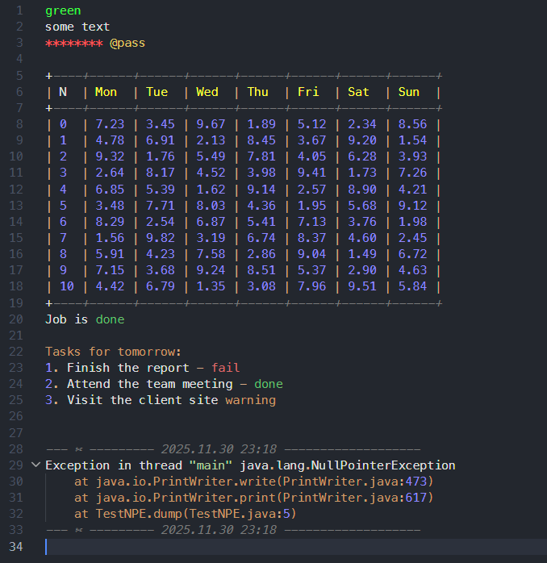

# Text Work

Do you work with text a lot? Do you want to highlight even txt files? This extension provides custom highlighting and productivity tools for `.txt` files (and `text-work` language).

## Features

### 1. Custom Highlighting
Provides rich syntax highlighting for `.txt` files, treating them as `text-work` language.
- **Keywords**: `status`, `error`, `run`, `if`, `else`, `install`, `cp`, `mv`, `tf`, `npm`, `npx`, `python`, `terraform`, `echo`, `git`, `ssh` and much more.
- **Colors**: `violet`, `red`, `green`, `yellow`, `blue`.
- **UUIDs**: Automatically highlights UUIDs.
- **Booleans**: Highlights `true`, `false`, `ok`, `fail`, etc.
- **Tags**: Highlights `@tags`.
- **Week days and months**: Highlights `mon`, `tue`, `wed`, `thu`, `fri`, `sat`, `sun`, `jan`, `feb`, `mar`, `apr`, `may`, `jun`, `jul`, `aug`, `sep`, `oct`, `nov`, `dec`.    
- **Emails & URLs**: Highlights email addresses and web links (`http://`, `https://`).
- **Abbreviations**: Highlights uppercase abbreviations (e.g., `ABC`, `API`) and words with underscores (e.g., `SN_Global_Support`).

### 2. Autobullet Lists
Automatically manages lists when you press `Enter`:
- **Standard Bullets**: `*`, `-`, `•`, `▪`, `▫`, `◦`, `‣`, `⁃` (converts `*` to `•`)
- **Numbering**: `1.`, `2.` (increments numbers)
- **Letters**: `a.`, `b.` (increments letters)
- **Roman Numerals**: `i.`, `ii.` (increments roman numerals)
- **Indentation**: Maintains indentation and supports nested lists.
- Pressing `Enter` on an empty list item clears the line.

### 3. Date/Time Insertion
- **Alt+Enter**: Insert current date/time separator line *after* the cursor.
- **Shift+Alt+Enter**: Insert current date/time separator line *before* the cursor.

### 4. Mask Passwords
- Add `@pass` next to a word in a line to mask it as a password.
- **Note**: PasswordMask fonts must be installed from the [fonts folder](https://github.com/ozinka/vs-text-work/tree/main/fonts). Install at least:
  - `PasswordMask-Regular.ttf`
  - `PasswordMask-Bold.ttf`

## Usage

1. Open any `.txt` file.
2. The language mode should automatically switch to `text-work` (or you can select it manually).
3. Enjoy the highlighting and productivity features!

## Extension Settings

This extension contributes the following settings:

*   `editor.tokenColorCustomizations`: Customizes colors for specific syntax tokens.
*   `editor.semanticTokenColorCustomizations`: Customizes semantic token colors.

## Release Notes

### 0.0.3
- Added support for Roman numeral and Letter based lists.
- Expanded keyword and color highlighting.
- General improvements and bug fixes.

### 0.0.1
Initial release with highlighting, autobullet, and date/time insertion features.
